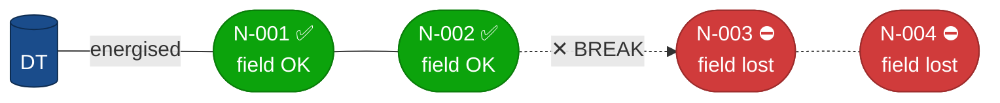
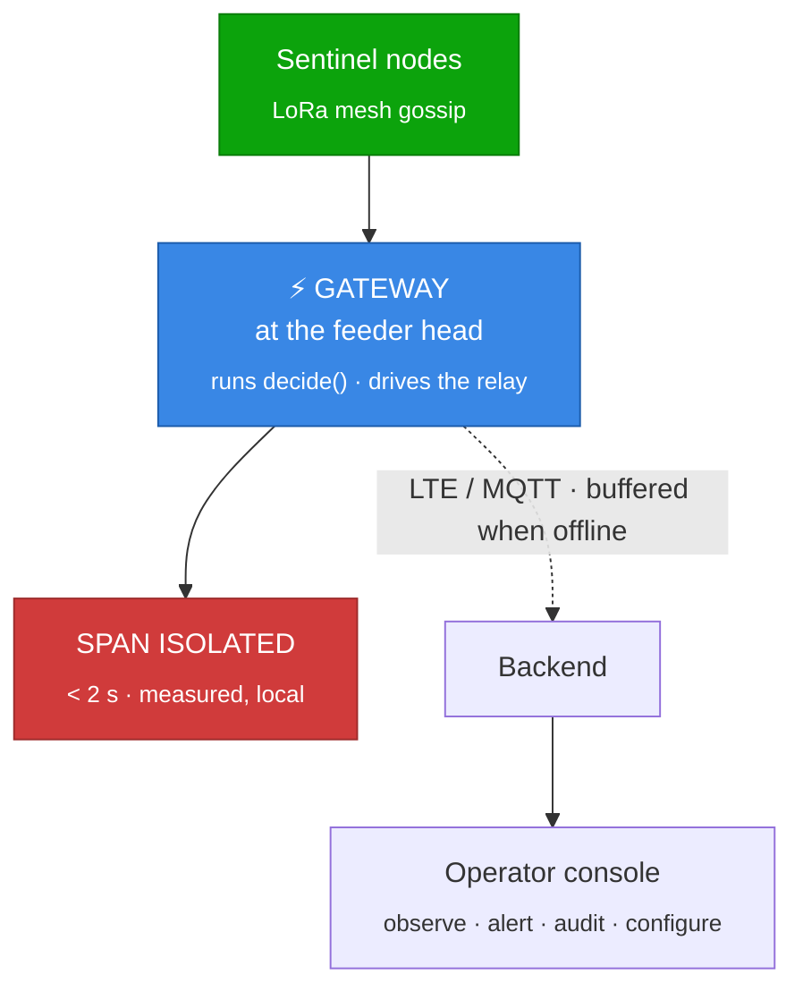

# ⚡ Closed-Circuit

### Detecting and isolating broken live LV overhead conductors

**A live wire on the ground draws less than the trip current.**
**So the fuse stays silent, and the wire stays live for hours.**

### ▸ [**Open the live operator console**](https://platform-ebon-six.vercel.app) ◂

Simulated feeder, live consensus engine. The backend sleeps on a free tier — 
the first load takes up to a minute and tells you so.

---

## The fault protection cannot see

A snapped low-voltage conductor lying on dry earth, asphalt or a tree is a
**high-impedance fault**. It is lethal to touch and it draws almost nothing —
far below the pickup an overcurrent relay or fuse needs. So conventional
protection does exactly what it was designed to do: nothing.

> **13,446** electrocution deaths in India in 2020 — *NCRB, ADSI 2020*

**We stop measuring current and measure the field instead.** A pole-mounted
capacitive probe watches the conductor's own 50 Hz electric field. No CT, no
line tap, no shutdown to install.

---

## How a break is detected

When a span breaks, everything downstream de-energises while the node
**upstream stays normal**. That asymmetry is the signature — and it is
unambiguous in a way that a barely-there fault current never is.

| | |
|---|---|
| **1 · Detect** | Deviation past −60% of the node's own EWMA baseline, sustained for 5 consecutive 50 ms windows. The sustain requirement is what a lightning transient cannot survive. |
| **2 · Gossip** | The node asserts `SUSPECT` and pre-empts routine telemetry to broadcast it over the LoRa mesh. |
| **3 · Quorum** | Two downstream neighbours must agree inside a 1.5 s window, **and** the node immediately upstream must still read `NORMAL` — or the span is wrong. |
| **4 · Isolate** | The gateway at the feeder head runs `decide()` locally and drives the relay. The cloud is told afterwards. It is never asked first. |

---

## One node is never enough

Rain, fog, vegetation contact and switching transients all perturb the field.
Anyone can build a detector that fires; the interesting half is the set of
cases that **must not**.

| Scenario | Verdict | Why |
|----------|---------|-----|
| Break mid-feeder | 🔴 **Isolate** | Downstream collapse, upstream normal |
| Break at tail | 🔴 **Isolate** | Tail span asserted |
| Rain burst | ✅ No trip | Recovers before the sustain window closes |
| Vegetation contact | ⚠️ Alert only | A single node is never a quorum |
| Substation outage | ✅ No trip | **Global-collapse veto** — that is an outage, not a break |
| Switching transient | ✅ No trip | 300 ms spike fails the sustain requirement |
| Node offline | ⚠️ Alert only | Comms loss is **never** a vote toward isolation |

All seven are committed test vectors. The Python and the C implementations are
held to the same fixtures in CI — **if they ever disagree, the build fails.**

---

## The trip path never touches the internet

An LTE round-trip alone can consume the entire two-second budget, and a safety
function that depends on a mobile network is not something a utility will
deploy. **Everything below the gateway only observes.**

**Designed failure modes**

- **Radio fails** → alarm raised, **no trip**. A jammed radio must not de-energise a healthy feeder.
- **LTE fails** → keep operating, buffer the uplink.
- **Watchdog resets** → come up in `LOCKOUT`, wait for a human to arm it.
- **Two breaks in 10 s** → rate-limited to one isolation per feeder per 60 s.
- **A physical lockout switch** overrides every line of software.
- **No auto-reclose, ever, in v1** — reclosing onto a downed conductor is how people die.

---

## What is proven, and what is not

We label these honestly, because a panel will ask.

| | Status | Backed by |
|---|---|---|
| **< 2 s** detection → isolation | ✅ **measured** | Real `latency_ms` on every event. The live demo shows ~120 ms. |
| **0** false trips in the bench set | ✅ **measured** | Seven committed vectors, Python **and** C, enforced in CI |
| **< 5 mA** average node current | ◌ target | Budgeted for a 6 V 1 W panel + 18650 LiFePO4, 5 days monsoon overcast. No board exists to meter yet. |
| **≥ 300 m** inter-node range | ◌ target | LoRa SF9 / BW 125 kHz / CR 4-5. To be measured in a field, not asserted. |
| Node BOM | ◌ not yet quotable | One line of the BOM is unpriced, so the test that guards it is deliberately red |

**No utility has deployed or reviewed this.** The pilot is a proposal, and we
would rather say so here than have it discovered.

---

## Repositories

| Repo | Contents |
|------|----------|
| 📜 [**protocol**](https://github.com/sentinel-lv/protocol) | The frozen contract — `PROTOCOL.md`, the seven shared test vectors. Submoduled into `platform` and `edge` so every implementation is held to one set of fixtures. |
| 🖥️ [**platform**](https://github.com/sentinel-lv/platform) | `frontend/` · `backend/` · `simulator/` — they share types and deploy together |
| 📡 [**edge**](https://github.com/sentinel-lv/edge) | `firmware/` · `gateway/` — they literally share `arbiter.c` |
| 🔌 [**hardware**](https://github.com/sentinel-lv/hardware) | KiCad schematics · BOM · characterisation data · enclosure STLs |

---

## Built by

**Team 173301 · Closed-Circuit** · VIT Bhopal University

| | | |
|---|---|---|
| **Pranav Shukla** — Lead · Full stack · [pranavmshukla.in](https://pranavmshukla.in) | **Md Danish** — Hardware | **Shaik Suhail** — Simulator |
| **Abhishek** — Firmware | **Arnav Sharma** — Gateway | **Shristy** — Frontend |

Mentor: **Dr. Abha Trivedi**, SCAI, VIT Bhopal University

---

## References

1. National Crime Records Bureau, *Accidental Deaths & Suicides in India 2020* — [ncrb.gov.in](https://ncrb.gov.in)
2. EPRI, *High-Impedance Faults on Distribution Systems: Approaches to Downed-Conductor Detection* — [epri.com](https://www.epri.com/research/products/000000003002030685)
3. A. Wontroba et al., *High-impedance fault detection on downed conductor in overhead distribution networks*, Electric Power Systems Research, 2022 — [sciencedirect.com](https://www.sciencedirect.com/science/article/abs/pii/S0378779622004254)
4. Schweitzer Engineering Laboratories, *Detection and Isolation of Broken Conductors* — [selinc.com](https://selinc.com/api/download/141150/)
5. LoRa Alliance regional parameters, IN865 (India 865–867 MHz licence-free band) — [lora-alliance.org](https://lora-alliance.org)

Smart India Hackathon 2026 · Student Innovation · Disaster Management · Hardware · VIT Bhopal

